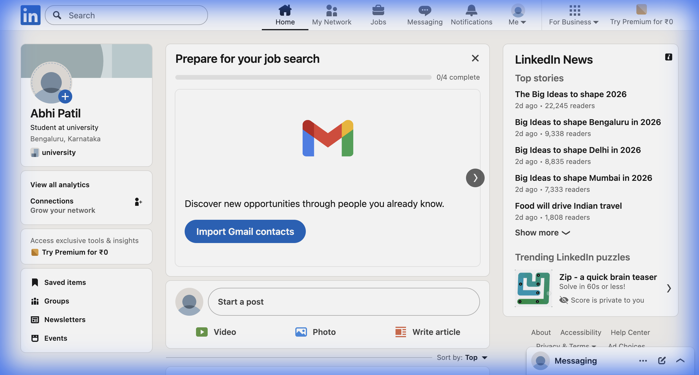
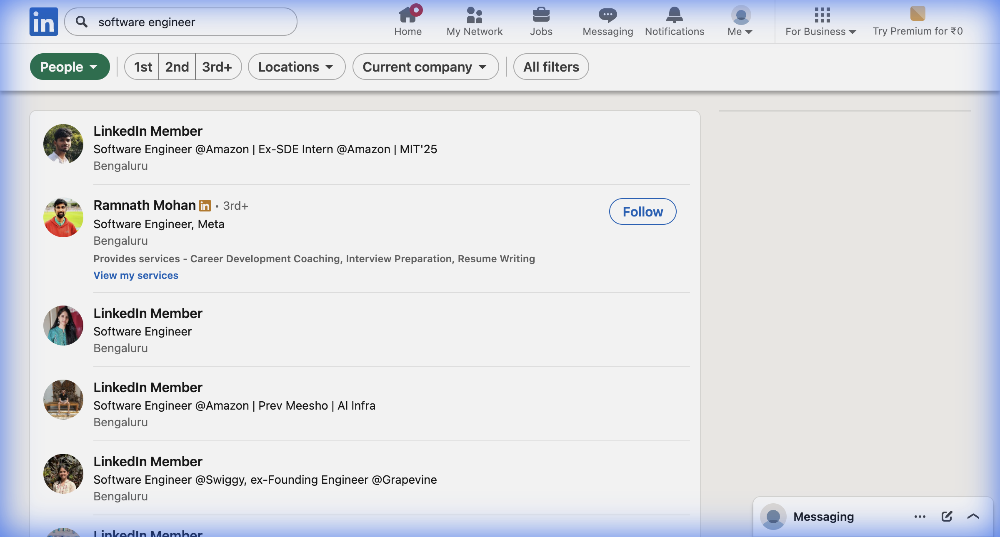
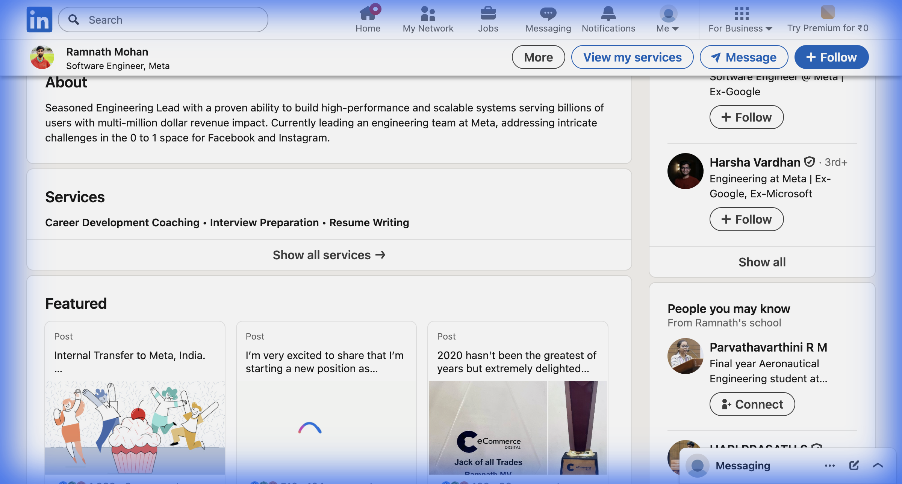

# LinkedIn Automation Tool

> 🎓 **Educational Project** - Demonstrates advanced browser automation, anti-detection techniques, and clean Go architecture.

⚠️ **IMPORTANT**: This tool is for educational and technical demonstration purposes only. Automating LinkedIn violates their Terms of Service. Do NOT use in production.

---

## 📸 Demo Screenshots

### ✅ Successful Login

*Browser automation successfully logged into LinkedIn account*

### 🔍 Profile Search Results

*Search for "Software Engineer" returned 10 matching profiles*

### 👤 Profile Viewing

*Viewing profile details of Ramnath Mohan (Software Engineer at Meta)*

---

## 🎬 Video Demonstration

### 📹 Video 1: Architecture & Flowchart
[](https://www.loom.com/share/0736753d640c4ff3947f80e4ef8eb364)

> Project explanation, system design, and flowchart walkthrough

**🔗 [Watch Architecture Video](https://www.loom.com/share/0736753d640c4ff3947f80e4ef8eb364)**

---

### 📹 Video 2: Live Demo
[](https://www.loom.com/share/5d7376cfdf044909af3229db9bbd47c5)

> Live demonstration of login, search, and connection automation

**🔗 [Watch Demo Video](https://www.loom.com/share/5d7376cfdf044909af3229db9bbd47c5)**

---

## 🚀 Features

### Core Functionality
| Feature | Description |
|---------|-------------|
| **Login** | Automated login with session persistence |
| **Search** | Find profiles by title, company, location |
| **Connect** | Send personalized connection requests |
| **Message** | Send follow-up messages to connections |
| **Stats** | View automation statistics |

### 🕵️ Anti-Detection Techniques (8 Implemented)

| # | Technique | Status | Description |
|---|-----------|--------|-------------|
| 1 | **Mouse Movement** | ✅ Mandatory | Bézier curves with overshoot and micro-corrections |
| 2 | **Timing Patterns** | ✅ Mandatory | Gaussian distribution for natural delays |
| 3 | **Fingerprint Masking** | ✅ Mandatory | WebGL, Canvas, Audio context masking |
| 4 | Scrolling | ✅ Optional | Variable speed, natural acceleration |
| 5 | Typing | ✅ Optional | Human-like keystroke timing with typos |
| 6 | Hovering | ✅ Optional | Natural cursor wandering |
| 7 | Scheduling | ✅ Optional | Business hours operation only |
| 8 | Rate Limiting | ✅ Optional | Daily/hourly quotas with cooldowns |

### 🔐 Core Functional Requirements

#### Authentication System
| Feature | Status | Implementation |
|---------|--------|----------------|
| Login from environment variables | ✅ | `auth.go` → `Login()` |
| Handle login failures gracefully | ✅ | `LoginResult` with error states |
| Detect 2FA/Captcha checkpoints | ✅ | `Requires2FA`, `RequiresCaptcha` |
| Persist session cookies | ✅ | `SaveCookies()`, `LoadCookies()` |

#### Search & Targeting
| Feature | Status | Implementation |
|---------|--------|----------------|
| Search by title/company/location | ✅ | `SearchCriteria` struct |
| Parse and collect profile URLs | ✅ | `parseSearchResults()` |
| Handle pagination | ✅ | Multi-page loop |
| Duplicate profile detection | ✅ | `IsDuplicateProfile()` |

#### Connection Requests
| Feature | Status | Implementation |
|---------|--------|----------------|
| Navigate to profiles | ✅ | `browser.Navigate()` |
| Click Connect precisely | ✅ | 5+ fallback selectors |
| Send personalized notes | ✅ | Template support |
| Track & enforce daily limits | ✅ | `RateLimiter` |

#### Messaging System
| Feature | Status | Implementation |
|---------|--------|----------------|
| Detect accepted connections | ✅ | `GetAcceptedConnections()` |
| Auto follow-up messages | ✅ | `MessageAcceptedConnections()` |
| Template with variables | ✅ | `TemplateData` struct |
| Message tracking | ✅ | SQLite storage |

### 📋 Code Quality Standards

| Standard | Status | Implementation |
|----------|--------|----------------|
| **Modular Architecture** | ✅ | 7 packages: auth, search, messaging, stealth, config, storage, connection |
| **Robust Error Handling** | ✅ | Retry logic, exponential backoff, graceful degradation |
| **Structured Logging** | ✅ | Zap logger with levels (debug, info, warn, error) |
| **Configuration Management** | ✅ | Viper + YAML + .env support |
| **State Persistence** | ✅ | SQLite with 4 tables (profiles, requests, messages, logs) |
| **Documentation** | ✅ | Doc comments on all public functions + README |

---

## 📦 Project Structure

```
linkedin-automation/
├── cmd/
│   └── linkedin-bot/
│       └── main.go              # CLI entry point
├── internal/
│   ├── auth/
│   │   └── auth.go              # Authentication logic
│   ├── config/
│   │   └── config.go            # Configuration management
│   ├── connection/
│   │   └── connect.go           # Connection request logic
│   ├── messaging/
│   │   └── messenger.go         # Messaging logic
│   ├── search/
│   │   └── search.go            # Search functionality
│   ├── stealth/
│   │   ├── mouse.go             # Human-like mouse movement
│   │   ├── timing.go            # Randomized timing
│   │   ├── fingerprint.go       # Browser fingerprint masking
│   │   ├── scroll.go            # Natural scrolling
│   │   ├── typing.go            # Realistic typing
│   │   ├── hover.go             # Mouse hovering
│   │   ├── schedule.go          # Activity scheduling
│   │   ├── ratelimit.go         # Rate limiting
│   │   └── types.go             # Shared types
│   └── storage/
│       └── sqlite.go            # SQLite database
├── pkg/
│   └── browser/
│       └── browser.go           # Rod browser wrapper
├── config/
│   └── config.yaml              # Default configuration
├── docs/
│   └── screenshots/             # Demo screenshots
├── .env.example                 # Environment template
├── go.mod
├── go.sum
└── README.md
```

---

## 🛠️ Installation

### Prerequisites
- Go 1.21 or higher
- Chrome browser (auto-downloaded by Rod)

### Setup

```bash
# Clone the repository
git clone <repository-url>
cd linkedin-automation

# Install dependencies
go mod download

# Build the CLI
go build -o linkedin-bot ./cmd/linkedin-bot

# Copy environment template
cp .env.example .env

# Edit .env with your credentials (for testing only)
nano .env
```

---

## ⚙️ Configuration

### Environment Variables (.env)

```bash
# LinkedIn Credentials (Required)
LINKEDIN_EMAIL=your_email@example.com
LINKEDIN_PASSWORD=your_password

# Browser Settings
HEADLESS=false          # Set to true for headless mode
DEBUG=true              # Enable debug logging

# Rate Limits
DAILY_CONNECTION_LIMIT=50
HOURLY_CONNECTION_LIMIT=10
```

### Configuration File (config/config.yaml)

```yaml
browser:
  headless: false
  viewport:
    width: 1920
    height: 1080

stealth:
  mouse_speed_min: 0.5
  mouse_speed_max: 1.5
  typing_min_ms: 50
  typing_max_ms: 150

limits:
  daily_connections: 50
  hourly_connections: 10
  daily_messages: 100

scheduling:
  start_hour: 9
  end_hour: 18
  timezone: "Asia/Kolkata"
```

---

## 📋 Usage

### Help
```bash
./linkedin-bot --help
```

### Login
```bash
./linkedin-bot login
```
Opens browser, logs into LinkedIn, and saves session cookies.

### Search Profiles
```bash
./linkedin-bot search --title "Software Engineer" --company "Google" --pages 3
```
Searches for profiles matching criteria and saves to database.

### Send Connection Requests
```bash
./linkedin-bot connect --limit 5 --note "Hi {{.FirstName}}, I'd love to connect!"
```
Sends personalized connection requests with rate limiting.

### Send Messages
```bash
./linkedin-bot message --template followup
```
Sends follow-up messages to accepted connections.

### View Statistics
```bash
./linkedin-bot stats
```
Shows automation statistics and rate limit status.

---

## 🧪 Testing

### Run Unit Tests
```bash
go test ./internal/stealth/... -v
go test ./internal/storage/... -v
```

### Run All Tests
```bash
go test ./... -v
```

### Manual Testing
1. Set up `.env` with test credentials
2. Run `./linkedin-bot login` (watch browser automation)
3. Run `./linkedin-bot search --title "Engineer" --pages 1`
4. Run `./linkedin-bot stats`

---

## 🏗️ Architecture

### Package Dependencies

```
main.go
    ├── auth       → browser, storage
    ├── search     → browser, storage  
    ├── connection → browser, storage, stealth
    └── messaging  → browser, storage, stealth
                        ↓
                    browser
                        ↓
                    stealth (8 techniques)
                        ↓
                    Rod → Chrome
```

### Data Flow

1. **CLI** parses commands and loads configuration
2. **Browser** initializes Chrome with stealth mode
3. **Stealth** layer intercepts all actions (mouse, typing, etc.)
4. **Core packages** (auth, search, connect, message) execute business logic
5. **Storage** persists state to SQLite database

---

## 🔒 Security Considerations

- Credentials are loaded from environment variables (never hardcoded)
- Session cookies are persisted locally (`.session.json`)
- Rate limiting prevents account detection
- Business hours scheduling mimics human behavior

---

## 📊 Project Statistics

| Metric | Value |
|--------|-------|
| Go Files | 17 |
| Lines of Code | 5,530+ |
| Packages | 7 |
| Stealth Techniques | 8 |
| CLI Commands | 5 |
| Core Requirements | 16/16 ✅ |
| Code Quality Standards | 6/6 ✅ |

---

## 📄 License

This project is for educational purposes only.

---

## ⚠️ Disclaimer

This tool is provided for educational and technical demonstration purposes only. The authors do not encourage or endorse the use of this tool to violate LinkedIn's Terms of Service or any applicable laws. Use at your own risk.
